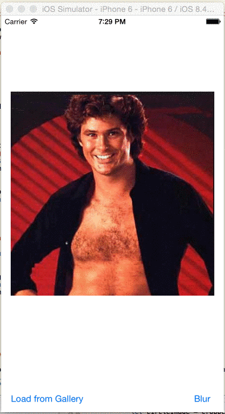

BlurFace
========

BlurFace is a swift component that allows to blur faces in an UIImage quite easily.



Usage
=====

BlurFace is available in CocoaPods

```
pod 'BlurFace', '~> 0.0.1'
```

Available methods
=================

`public func hasFaces() -> Bool`

Check whether the image contains any face

`public func blurFaces() -> UIImage`

Return a new image blurring all the faces found in the original image
